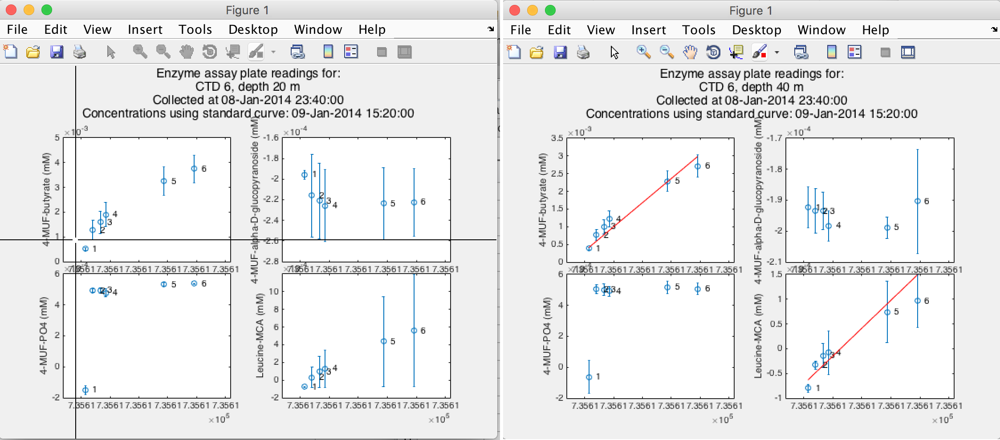

# ExoenzymeHydroCalc
[ExoenzymeHydroCalc](https://github.com/jamesrco/GeoSciData_IO/blob/master/ExoenzymeHydroCalc/): The script [Exoenzyme_plate_data_read_Tecan_F200.m](https://github.com/jamesrco/GeoSciData_IO/blob/master/ExoenzymeHydroCalc/Exoenzyme_plate_data_read_Tecan_F200.m) and dependencies. Interactively calculates rates of bacterial exoenzyme hydrolysis using fluoresence data from 96-well plate incubations with fluorogenic substrates. 

Using cursor, allows user to graphically define ranges of data points in each incubation over which a linear regression should be applied (first panel); a regression is then calculated and superimposed to provide the user with feedback (second panel):

The script is currently configured to parse data in .txt files from a Tecan F200 plate reader, but could be easily modified for data from another instrument. Current version of script presumes plates are configured according to [this protocol](https://github.com/jamesrco/GeoSciData_IO/blob/master/ExoenzymeHydroCalc/Enzyme Assay Protocol from Edwards et al. 2011.docx) used in Edwards et al. 2011. Example files containing sample data and standard curve data are given in a sub-repository.

Although this script was designed for calculation of exoenzyme hydrolysis rates, the automated fitting of multiple standard curves and graphical selection of ranges for linear regression of multiple data series could be useful for any rate-based (bio)chemical calculation that is frequently repeated.

For a good introduction to the use of bacterial exoenzyme activity assays in aquatic and marine environments, see H. Hoppe, 1993, "[Use of Fluorogenic Model Substrates for Extracellular Enzyme Activity (EEA) Measurement of Bacteria](http://ecosystems.mbl.edu/SES/MicrobialMethods/AssignedReadings/HoppeCh48_1983.pdf)," in Kemp, P. F., and others, eds., Handbook of Methods in Aquatic Microbial Ecology, pp. 423-431.
